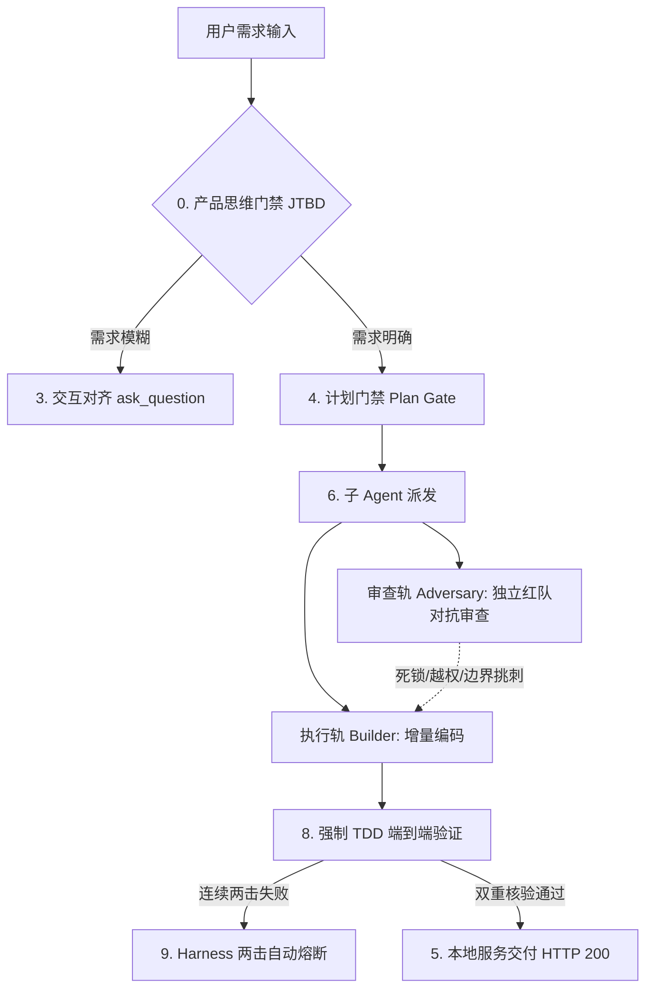

# Google Antigravity Agent Protocol (`AGENTS.md`) ⚡
### 工业级 Google Antigravity 防幻觉、红队对抗审查与闭环交付工程协议 (v3.0.21)

[](https://github.com/Alphaxiaoteng/antigravity-agent-protocol)
[](https://github.com/Alphaxiaoteng/antigravity-agent-protocol)
[](SUBAGENTS.md#-2-核心机制红队对抗审查三要素-adversarial-red-team-audit)
[](https://opensource.org/licenses/MIT)
[](http://makeapullrequest.com)

[核心工程协议 (AGENTS.md)](AGENTS.md) | [子 Agent 对抗审查手册 (SUBAGENTS.md)](SUBAGENTS.md) | [极速接入](#-极速接入-quick-start)

---

## 💥 为什么需要 Antigravity Agent Protocol？

传统 AI 编程助手在大型复杂项目中极易产生**“代码破坏”、“盲目死循环”**与**“自编自审偏见”**。

**Antigravity Agent Protocol (v3.0.21)** 是一套经过高强度生产环境压测的工业级 Agentic AI 约束标准，彻底解决自主编码的核心顽疾：



### 🛡️ 五大硬核防御机制

1. **🛡️ 零占位符破坏**：严格拦截 `// ... existing code ...` 等破坏性占位重写，保留所有已有业务逻辑与注释。
2. **⚡ 两击熔断机制 (Two-Strike Circuit Breaker)**：同类修复连续失败 2 次强制停止并输出带证据链根因报告，杜绝无意义 Token 消耗与死循环。
3. **🎯 Ponytail 最小正确改动**：非当前必需不写，严格约束 Diff 范围，禁止顺手重构与过度设计。
4. **👥 红队对抗审查 (Adversarial Audit)**：执行轨（Builder）与审查轨（Adversary）权限物理隔离，审查者通过并发死锁注入、越权攻击与盲盒 Diff 推演消除作者先验偏见。
5. **🧪 强制闭环交付与 TDD 验证**：写完逻辑紧接着执行终端测试与断言探针，严禁未经验证宣称完成。

---

## 📁 核心文档导航

| 核心文件 | 作用与定位 |
| :--- | :--- |
| **📄 [AGENTS.md](AGENTS.md)** | **工作区核心工程协议 (v3.0.21)**：涵盖 0~9 大硬核纪律（产品思维、防幻觉、两击熔断、Ponytail 最小修改、双重服务核验、强制 TDD 验证、Harness 自优化）。 |
| **🤖 [SUBAGENTS.md](SUBAGENTS.md)** | **Subagent 角色分工与红队对抗审查手册 (v3.0.21)**：定义了侦察员 (Scout)、开发员 (Builder)、架构师 (Architect) 与红队审查员 (Adversary) 的双轨隔离机制、死锁注入方法论与标准派发 JSON 模版。 |

---

## ⚡ 极速接入 (Quick Start)

在任何工程根目录下直接拉取最新 v3.0.21 协议文件：

```bash
# 1. 下载核心工程协议 AGENTS.md
curl -sSL https://raw.githubusercontent.com/Alphaxiaoteng/antigravity-agent-protocol/main/AGENTS.md -o AGENTS.md

# 2. 下载子 Agent 对抗审查手册 SUBAGENTS.md
curl -sSL https://raw.githubusercontent.com/Alphaxiaoteng/antigravity-agent-protocol/main/SUBAGENTS.md -o SUBAGENTS.md
```

---

## 📄 License

本项目采用 [MIT License](LICENSE) 许可证开源，欢迎自由引用、Fork 与社区共建！
