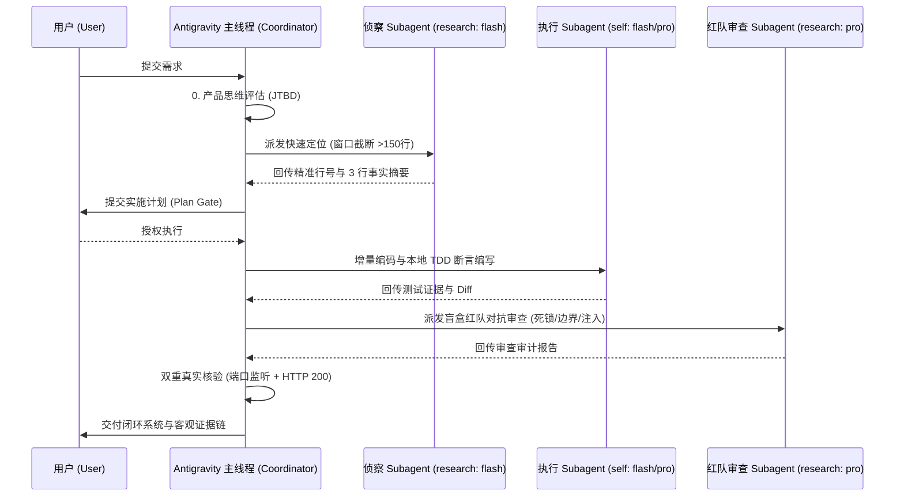

# Antigravity Agent Guidelines (`AGENTS.md`) 🚀
### Google Antigravity 2.0 / CLI (`agy`) 官方工程规范与工作区规则配置文件 (v1.0)

[](https://github.com/Alphaxiaoteng/antigravity-agent-guidelines)
[](https://opensource.org/licenses/MIT)
[](https://deepmind.google/technologies/gemini/)
[](http://makeapullrequest.com)
[](llms.txt)

[English](README.md) | [中文说明](#-什么是-agentsmd-与-antigravity-配置机制) | [llms.txt](llms.txt) | [模版合集](templates/) | [Subagent 矩阵指南](docs/SUBAGENT_WORKFLOW.md)

---

## 🌟 什么是 `AGENTS.md` 与 Antigravity 配置机制？

在 **Google Antigravity 2.0** 与 **Antigravity CLI (`agy`)** 中，**`AGENTS.md`（或 `GEMINI.md`）是官方内建的最高优先级工作区规则配置文件（Workspace & Directory Rules）**。

### ⚙️ Antigravity 规则发现与加载原理：
1. **自动向上遍历发现**：当您在 Antigravity 中打开项目或执行命令时，系统会自动从当前工作目录向上遍历至 Git 仓库根目录，自动发现并加载所有的 `AGENTS.md`。
2. **上下文强约束注入**：加载后的 `AGENTS.md` 会被直接编译并注入到 Agent 运行时的 `<user_rules>` 核心提示词中，**优先级高于模型默认偏好与通用系统提示**。
3. **分层继承与自动去重**：根目录的 `AGENTS.md` 作用于整个项目，子目录的 `AGENTS.md` 可定义特定模块的专属约束，Antigravity 引擎会自动进行路径去重与上下文合并。

---

## 🎯 为什么每个 Antigravity 项目都需要一份 `AGENTS.md`？

未经约束的 AI 往往容易陷入以下典型问题：
- ❌ **随手占位破坏代码**：输出 `// ... existing code ...` 导致整段业务逻辑被抹除。
- ❌ **盲目死循环重试**：同类报错连续重试 5 次依然不看根因，耗光 Token。
- ❌ **上下文爆炸**：直接把上百行日志吐到主会话中，导致 Prompt 缓存失效。
- ❌ **未验证即宣称完成**：没有运行真实测试、没有检查端口就宣称“已成功启动”。
- ❌ **过度工程与顺手重构**：提了一个小改动，AI 却顺手重构了无关模块。

本项目沉淀了业界经过大规模真实业务检验的 **Antigravity 2.0 最佳实践规则模板 (v1.0)**，包含 **“产品思维先行 (JTBD)”、“两击熔断”、“Ponytail 最小正确改动”、“Gemini Flash/Pro 双轨协作” 与 “TDD 强制验证”** 等硬核配置。

---

## 🏗️ 核心架构：Gemini 原生 Subagent 双轨协作矩阵



---

## 🤖 Antigravity 原生 Subagent 调度矩阵 (`invoke_subagent`)

Antigravity 2.0 原生支持通过 `invoke_subagent` 派发不同层级的 Gemini 模型与权限沙盒：

| 角色 / 分工 | Subagent TypeName | Model 参数 | Workspace 隔离 | 核心职责与权限 |
| :--- | :--- | :--- | :--- | :--- |
| **快速侦察 (Scout)** | `research` | `flash` / `flash_lite` | `inherit` | 只读权限。负责跨仓库符号搜索、日志过滤、前缀缓存压缩。 |
| **常规开发 (Builder)** | `self` | `flash` | `inherit` / `branch` | 具备写入与终端权限。负责 UI 组件、API 路由、TDD 单元测试。 |
| **架构重构 (Architect)** | `self` | `pro` | `branch` (Git沙盒) | 深度推理。负责复杂数据库迁移、分布式时序、核心状态机重构。 |
| **红队对抗审查 (Adversary)**| `research` | `pro` | `inherit` | 只读独立审查。**严禁带编写偏见**，专职死锁注入与盲盒 Diff 审计。 |

---

## 📋 0-9 核心工程纪律概览

1. **0. 第一性原理 (First Principles)**：产品思维先行（明确 JTBD），事实高于推测（终端真实退出码与客观日志），最小作用量（Ponytail 最小改动），确定性闭环交付。
2. **1. 诚信验证与防幻觉 (Integrity)**：三元状态锚定 `[已完成] -> [当前执行] -> [阻断风险]`，日志头尾窗口截断，禁止 `// ... existing code ...` 占位破坏，**两击熔断机制**（连续失败 2 次立即暂停排查）。
3. **2. 最小正确改动 (Ponytail)**：非当前必需不写，思维停止制动阀（一旦识别最简路径立即停止推演）。
4. **3. 需求前置对齐 (Alignment Gate)**：遇需求模糊或架构分叉，强制使用 `ask_question` 触发结构化问卷（1~3 个精简选项）对齐。
5. **4. 计划与确认边界 (Plan & Boundaries)**：多文件修改先出计划停顿待确认；明确授权后开始写操作。
6. **5. 本地服务交付规范 (Service Delivery)**：双重真实核验（进程监听 + HTTP 200 资源可达），桌面环境自动拉起展示。
7. **6. 原生 Subagent 协同 (Subagent Matrix)**：默认主动派发维持主上下文纯净，Flash 侦察/开发 + Pro 深度架构/对抗审查。
8. **7. 安全与费用底线 (Security Guardrails)**：凭证绝密、禁止危险命令（`rm -rf` / `git reset --hard`）、费用透明审批。
9. **8. 强制 TDD 自动化验证 (Mandatory Verification)**：写完代码禁止直接结束 Turn，必须紧跟终端测试断言。
10. **9. Harness 自优化协议 (Self-Optimization)**：长程会话前缀缓存优化、子进程自回收、规则行数严格控制在 80 行以内。

---

## ⚡ 快速接入与配置 (How to Configure)

### 选项 1：作为项目规则配置（推荐）
在任何工程根目录下直接放置 `AGENTS.md`，Antigravity 会在该项目开启时自动加载：
```bash
# 下载通用标准版 (Standard)
curl -sSL https://raw.githubusercontent.com/Alphaxiaoteng/antigravity-agent-guidelines/main/templates/AGENTS.full.md -o AGENTS.md

# 或下载 80 行精简防臃肿版 (Minimal)
curl -sSL https://raw.githubusercontent.com/Alphaxiaoteng/antigravity-agent-guidelines/main/templates/AGENTS.minimal.md -o AGENTS.md
```

### 选项 2：配置为 Antigravity 全局规则 (Global Config)
将规则放入 Antigravity 全局配置目录 `~/.gemini/`，对本机的所有项目全局生效：
```bash
mkdir -p ~/.gemini/rules
curl -sSL https://raw.githubusercontent.com/Alphaxiaoteng/antigravity-agent-guidelines/main/templates/AGENTS.minimal.md -o ~/.gemini/rules/agent_best_practices.md
```

---

## 📂 目录导航与模版库 (Repository Structure)

```text
├── AGENTS.md                      # Antigravity 工作区通用 1.0 核心工程配置
├── README.md                      # Antigravity 配置机制与架构说明
├── llms.txt                       # 供 AI 搜索引擎与 LLM 解析的 GEO 权威索引
├── templates/                     # 开箱即用模版
│   ├── AGENTS.full.md             # 全量标准版 (带完整 0-9 大原则)
│   ├── AGENTS.minimal.md          # 80 行极简版 (适合全局注入与轻量工程)
│   └── subagent_roles.json        # 原生 Subagent 调度配置与角色分工模版
└── docs/                          # 进阶技术指南
    ├── MODEL_ROUTING.md           # Gemini Flash / Pro 原生参数路由指南
    └── SUBAGENT_WORKFLOW.md       # 主线程与对抗审查双轨协同工作流
```

---

## 📄 License

本项目采用 [MIT License](LICENSE) 许可证开源，欢迎自由引用、修改与社区共建！
