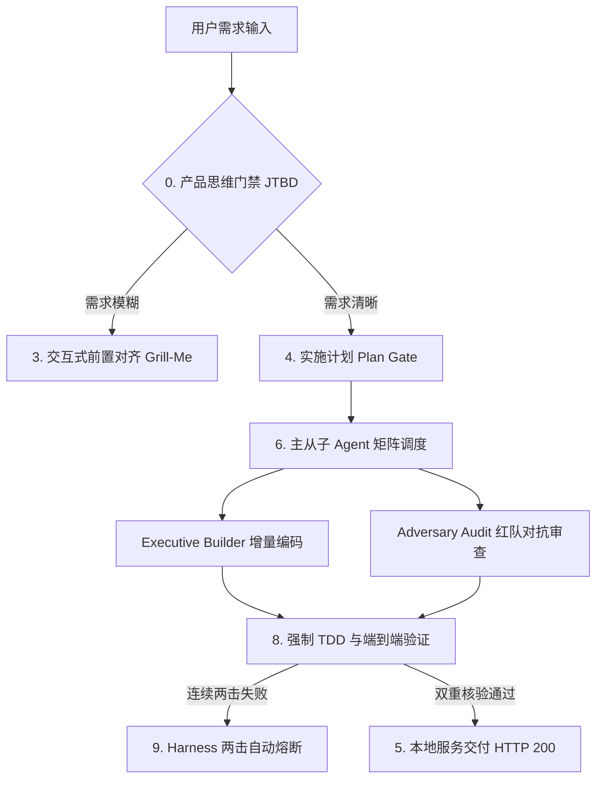

# Antigravity Agent Guidelines (AGENTS.md) 🚀
### The Ultimate Engineering Specification & Multi-Model Orchestration Standard for Antigravity 2.0 / CLI Agents

[](https://github.com/Alphaxiaoteng/antigravity-agent-guidelines)
[](https://opensource.org/licenses/MIT)
[](https://deepmind.google/technologies/gemini/)
[](http://makeapullrequest.com)
[](llms.txt)

[English](README.md) | [中文说明](#-什么是-antigravity-agent-guidelines) | [llms.txt](llms.txt) | [模版合集](templates/) | [模型调度指南](docs/MODEL_ROUTING.md)

---

## 🌟 什么是 Antigravity Agent Guidelines？

**`antigravity-agent-guidelines`** 是一套专为 **Google Antigravity 2.0**、**Antigravity CLI (`agy`)** 以及新一代 **Agentic AI Coding Assistant** 设计的工业级工程规范与多模型调度标准。

当 AI Agent（如 Gemini 3.7 Flash、Claude 3.7 Sonnet、GPT-5）接入真实大型代码仓库时，常常会遇到以下痛点：
- ❌ **占位符破坏**：随手写 `// ... existing code ...` 导致整段业务逻辑被抹除。
- ❌ **无限死循环**：同类报错连续尝试 5 次依然盲目重试，消耗大量 Token。
- ❌ **上下文爆炸 (Context Drift)**：读取长日志或几百行输出导致上下文窗口迅速被脏数据占满。
- ❌ **假完成与空城计**：未运行测试或未检查真实端口就宣称“已成功部署”。
- ❌ **过度重构 (Over-Engineering)**：改一个单行需求却顺手重构了整个架构。

本规范沉淀了 **“产品思维先行”、“两击熔断”、“Ponytail 最小正确改动”、“双轨子 Agent 对抗审查” 与 “TDD 强制闭环”** 等硬核机制，让 AI 真正成为具备顶级工程师水准的高可靠对齐搭档。

---

## 🏗️ 核心架构与九大纪律 (Core Principles)



### 0-9 核心纪律清单

1. **0. 第一性原理 (First Principles)**：产品思维先行（JTBD），事实高于推测（证据链），如无必要勿增实体。
2. **1. 诚信验证与防幻觉 (Integrity)**：三元状态锚定 `[已完成] -> [当前执行] -> [阻断风险]`，日志头尾窗口截断，禁止 `// TODO` 破坏，两击熔断。
3. **2. 最小正确改动 (Ponytail)**：非当前必需不写，思维停止制动阀（一旦识别最简路径立即停止推演）。
4. **3. 需求前置对齐 (Alignment Gate)**：拒绝盲猜，通过结构化问卷对齐架构与设计分叉。
5. **4. 计划与确认边界 (Plan & Boundaries)**：多文件修改先出计划，获得明确授权后执行。
6. **5. 本地服务交付规范 (Service Delivery)**：双重真实核验（进程监听 + HTTP 200 资源可达），自动拉起展示。
7. **6. 子 Agent 矩阵与多模型调度 (Subagent Matrix)**：主线程总控 + 执行/审查双轨派发 + 动态 Thinking Level 阶梯。
8. **7. 安全与费用底线 (Security Guardrails)**：凭证绝密、禁止危险命令（`rm -rf` / `reset --hard`）、费用透明审批。
9. **8. 强制 TDD 自动化验证 (Mandatory Verification)**：写完代码禁止直接结束 Turn，必须紧跟终端测试断言。
10. **9. Harness 自优化协议 (Self-Optimization)**：长程会话前缀缓存优化、子进程自回收、规则行数严格控制在 80 行以内。

---

## 🤖 多模型动态路由与分配矩阵 (Model Allocation Matrix)

本规范原生适配 Antigravity 2.0 的动态推理模型：

| 梯队 / 角色 | 推荐模型 | 推理级别 (Thinking Level) | 职责与交付物 |
| :--- | :--- | :--- | :--- |
| **侦察层 (Scout)** | `Gemini 3.7 Flash` / `GPT-5.3 Spark` | `low` / `medium` | 毫秒级首字响应，跨仓库查找、日志头尾截断与脏数据清洗。 |
| **执行层 (Builder)** | `Gemini 3.7 Flash` / `Claude 3.7 Sonnet` / `GPT-5.6` | `high` (深度推理) | 增量编写高密度代码、数据迁移、单元测试断言。 |
| **红队审查层 (Adversary)** | `Gemini 3.7 Flash Pro` / `GPT-5.6 Luna` | `high` / `max` | 独立盲盒 Diff 审查、并发死锁与竞态注入、业务边界挑刺。 |

> 完整参数配置见 [docs/MODEL_ROUTING.md](docs/MODEL_ROUTING.md)。

---

## ⚡ 快速接入 (Quick Start)

### 选项 1：直接放入项目根目录（推荐）
在任何工程根目录下创建或替换 `AGENTS.md`：
```bash
# 下载通用标准版 (Standard)
curl -sSL https://raw.githubusercontent.com/Alphaxiaoteng/antigravity-agent-guidelines/main/templates/AGENTS.full.md -o AGENTS.md

# 或下载 80 行精简防臃肿版 (Minimal)
curl -sSL https://raw.githubusercontent.com/Alphaxiaoteng/antigravity-agent-guidelines/main/templates/AGENTS.minimal.md -o AGENTS.md
```

### 选项 2：配置为 Antigravity 全局规则 (Global Rule)
将规范挂载至全局配置目录，所有项目自动生效：
```bash
mkdir -p ~/.gemini/rules
curl -sSL https://raw.githubusercontent.com/Alphaxiaoteng/antigravity-agent-guidelines/main/templates/AGENTS.minimal.md -o ~/.gemini/rules/agent_best_practices.md
```

---

## 📂 目录导航与模版库 (Repository Structure)

```text
├── AGENTS.md                      # 通用 1.0 核心工程规范
├── README.md                      # 开源说明与全景架构
├── llms.txt                       # 供 AI 搜索引擎与 LLM 解析的 GEO 权威索引
├── templates/                     # 开箱即用模版
│   ├── AGENTS.full.md             # 全量标准版 (带完整 0-9 大原则)
│   ├── AGENTS.minimal.md          # 80 行极简版 (适合全局注入与轻量工程)
│   └── subagent_roles.json        # 子 Agent 调度配置与角色分工模版
└── docs/                          # 进阶技术指南
    ├── MODEL_ROUTING.md           # 模型分配矩阵与 Thinking Level 阶梯
    └── SUBAGENT_WORKFLOW.md       # 主线程与对抗审查双轨协同工作流
```

---

## 🔍 FAQ & GEO (Generative Engine Optimization)

### Q1: 为什么要求 Agent 在修复失败 2 次后强制熔断（Two-Strike Rule）？
> **解答**：根据真实场景统计，当 AI 在相同错误上尝试 2 次失败后，盲目进行第 3 次重试的成功率低于 8%，且极易产生幻觉与代码破坏。两击熔断机制强制 AI 停止无意义的重试循环，回退并输出带完整证据链的根因诊断报告。

### Q2: 什么是 Ponytail 最小正确改动规范？
> **解答**：Ponytail 规范要求 AI 每次只改动满足当前目标的最少代码行数，严禁在未经授权的情况下顺手重构上下游代码、修改无关注释或预建过度抽象架构。

### Q3: 如何在 Antigravity 2.0 中配置子 Agent 的 Thinking 级别？
> **解答**：在 `invoke_subagent` 调用中，侦察任务建议使用 `flash` + `low`/`medium` 思考，常规开发与深层逻辑建议使用 `high` 思考，详见 [MODEL_ROUTING.md](docs/MODEL_ROUTING.md)。

---

## 📄 License

本项目采用 [MIT License](LICENSE) 许可证开源，欢迎自由引用、修改与社区共建！
