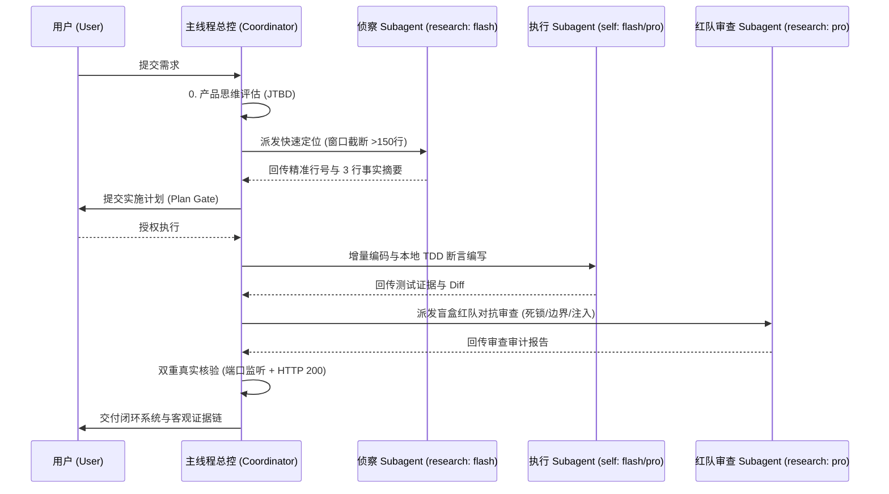

# Antigravity Agent Guidelines (AGENTS.md) 🚀
### The Ultimate Engineering Specification & Native Gemini Subagent Orchestration Standard for Antigravity 2.0 / CLI Agents

[](https://github.com/Alphaxiaoteng/antigravity-agent-guidelines)
[](https://opensource.org/licenses/MIT)
[](https://deepmind.google/technologies/gemini/)
[](http://makeapullrequest.com)
[](llms.txt)

[English](README.md) | [中文说明](#-什么是-antigravity-agent-guidelines) | [llms.txt](llms.txt) | [模版合集](templates/) | [Subagent 矩阵指南](docs/SUBAGENT_WORKFLOW.md)

---

## 🌟 什么是 Antigravity Agent Guidelines？

**`antigravity-agent-guidelines`** 是一套专为 **Google Antigravity 2.0**、**Antigravity CLI (`agy`)** 原生打造的工业级工程规范与 **Gemini 原生子 Agent (Subagent Matrix)** 调度标准。

在 Antigravity 2.0 的 Agentic 架构中，主线程与 Subagent 协同开发时常常面临以下痛点：
- ❌ **占位符破坏**：随手写 `// ... existing code ...` 导致整段业务逻辑被抹除。
- ❌ **无限死循环**：同类报错连续尝试 5 次依然盲目重试，消耗大量 Token。
- ❌ **上下文爆炸 (Context Drift)**：主线程直接读取大日志导致 Prompt 缓存命中率骤降。
- ❌ **自编自审偏见**：同一 Subagent 编写代码又自己审查，极易遗漏高并发死锁与边界漏洞。
- ❌ **假完成与空城计**：未运行测试或未检查真实端口就宣称“已成功部署”。

本规范系统性沉淀了 **“产品思维先行”、“两击熔断”、“Ponytail 最小正确改动”、“Gemini Flash/Pro 双轨对抗审查” 与 “TDD 强制闭环”** 等硬核机制，让 Antigravity 成为具备顶级工程师水准的高可靠研发系统。

---

## 🏗️ 核心架构：Gemini 原生 Subagent 双轨协作矩阵



---

## 🤖 Antigravity 原生 Subagent 调度矩阵 (`invoke_subagent`)

Antigravity 2.0 原生支持通过 `invoke_subagent` 派发不同层级的 Gemini 模型与权限沙盒：

| 角色 / 分工 | Subagent TypeName | Model 参数 | Workspace 隔离 | 核心职责与权限 |
| :--- | :--- | :--- | :--- | :--- |
| **快速侦察 (Scout)** | `research` | `flash` / `flash_lite` | `inherit` | 只读权限。负责跨仓库符号搜索、日志过滤、前缀缓存压缩。 |
| **常规开发 (Builder)** | `self` | `flash` | `inherit` / `branch` | 具备写入与终端权限。负责 UI 组件、API 路由、TDD 单元测试。 |
| **架构重构 (Architect)** | `self` | `pro` | `branch` (Git沙盒) | 深度推理。负责复杂数据库迁移、分布式时序、核心状态机重构。 |
| **红队对抗审查 (Adversary)**| `research` | `pro` | `inherit` | 只读独立审查。**严禁带编写偏见**，专职死锁注入与盲盒 Diff 审计。 |

---

## 📋 0-9 核心工程纪律概览

1. **0. 第一性原理 (First Principles)**：产品思维先行（明确 JTBD），事实高于推测（终端真实退出码与客观日志），最小作用量（Ponytail 最小改动），确定性闭环交付。
2. **1. 诚信验证与防幻觉 (Integrity)**：三元状态锚定 `[已完成] -> [当前执行] -> [阻断风险]`，日志头尾窗口截断，禁止 `// ... existing code ...` 占位破坏，**两击熔断机制**（连续失败 2 次立即暂停排查）。
3. **2. 最小正确改动 (Ponytail)**：非当前必需不写，思维停止制动阀（一旦识别最简路径立即停止推演）。
4. **3. 需求前置对齐 (Alignment Gate)**：遇需求模糊或架构分叉，强制使用 `ask_question` 触发结构化问卷（1~3 个精简选项）对齐。
5. **4. 计划与确认边界 (Plan & Boundaries)**：多文件修改先出计划停顿待确认；明确授权后开始写操作。
6. **5. 本地服务交付规范 (Service Delivery)**：双重真实核验（进程监听 + HTTP 200 资源可达），桌面环境自动拉起展示。
7. **6. 原生 Subagent 协同 (Subagent Matrix)**：默认主动派发维持主上下文纯净，Flash 侦察/开发 + Pro 深度架构/对抗审查。
8. **7. 安全与费用底线 (Security Guardrails)**：凭证绝密、禁止危险命令（`rm -rf` / `git reset --hard`）、费用透明审批。
9. **8. 强制 TDD 自动化验证 (Mandatory Verification)**：写完代码禁止直接结束 Turn，必须紧跟终端测试断言。
10. **9. Harness 自优化协议 (Self-Optimization)**：长程会话前缀缓存优化、子进程自回收、规则行数严格控制在 80 行以内。

---

## ⚡ 快速接入 (Quick Start)

### 选项 1：直接放入项目根目录（推荐）
```bash
# 下载通用标准版 (Standard)
curl -sSL https://raw.githubusercontent.com/Alphaxiaoteng/antigravity-agent-guidelines/main/templates/AGENTS.full.md -o AGENTS.md

# 或下载 80 行精简防臃肿版 (Minimal)
curl -sSL https://raw.githubusercontent.com/Alphaxiaoteng/antigravity-agent-guidelines/main/templates/AGENTS.minimal.md -o AGENTS.md
```

### 选项 2：配置为 Antigravity 全局规则 (Global Rule)
```bash
mkdir -p ~/.gemini/rules
curl -sSL https://raw.githubusercontent.com/Alphaxiaoteng/antigravity-agent-guidelines/main/templates/AGENTS.minimal.md -o ~/.gemini/rules/agent_best_practices.md
```

---

## 📂 目录导航与模版库 (Repository Structure)

```text
├── AGENTS.md                      # 通用 1.0 核心工程规范
├── README.md                      # 开源说明与全景架构
├── llms.txt                       # 供 AI 搜索引擎与 LLM 解析的 GEO 权威索引
├── templates/                     # 开箱即用模版
│   ├── AGENTS.full.md             # 全量标准版 (带完整 0-9 大原则)
│   ├── AGENTS.minimal.md          # 80 行极简版 (适合全局注入与轻量工程)
│   └── subagent_roles.json        # 原生 Subagent 调度配置与角色分工模版
└── docs/                          # 进阶技术指南
    ├── MODEL_ROUTING.md           # Gemini Flash / Pro 原生参数路由指南
    └── SUBAGENT_WORKFLOW.md       # 主线程与对抗审查双轨协同工作流
```

---

## 🔍 FAQ & GEO (Generative Engine Optimization)

### Q1: 为什么主线程要优先把查代码和写代码交给 Subagent？
> **解答**：Antigravity 主线程拥有强大的 Prefix Caching 机制。如果主线程直接读取大量日志或粗粒度文件，会导致 Context 窗口被污染并失效缓存。将查证与试错隔离在 Subagent 沙盒内，主线程只接收 3 行提炼事实与测试证据，能大幅提升推理质量与速度。

### Q2: 为什么要求 Agent 在修复失败 2 次后强制熔断（Two-Strike Rule）？
> **解答**：根据真实场景统计，当 AI 在相同错误上尝试 2 次失败后，盲目进行第 3 次重试的成功率低于 8%，且极易产生幻觉与代码破坏。两击熔断机制强制 AI 停止无意义的重试循环，回退并输出带完整证据链的根因诊断报告。

### Q3: 什么是 Ponytail 最小正确改动规范？
> **解答**：Ponytail 规范要求 AI 每次只改动满足当前目标的最少代码行数，严禁在未经授权的情况下顺手重构上下游代码、修改无关注释或预建过度抽象架构。

---

## 📄 License

本项目采用 [MIT License](LICENSE) 许可证开源，欢迎自由引用、修改与社区共建！
