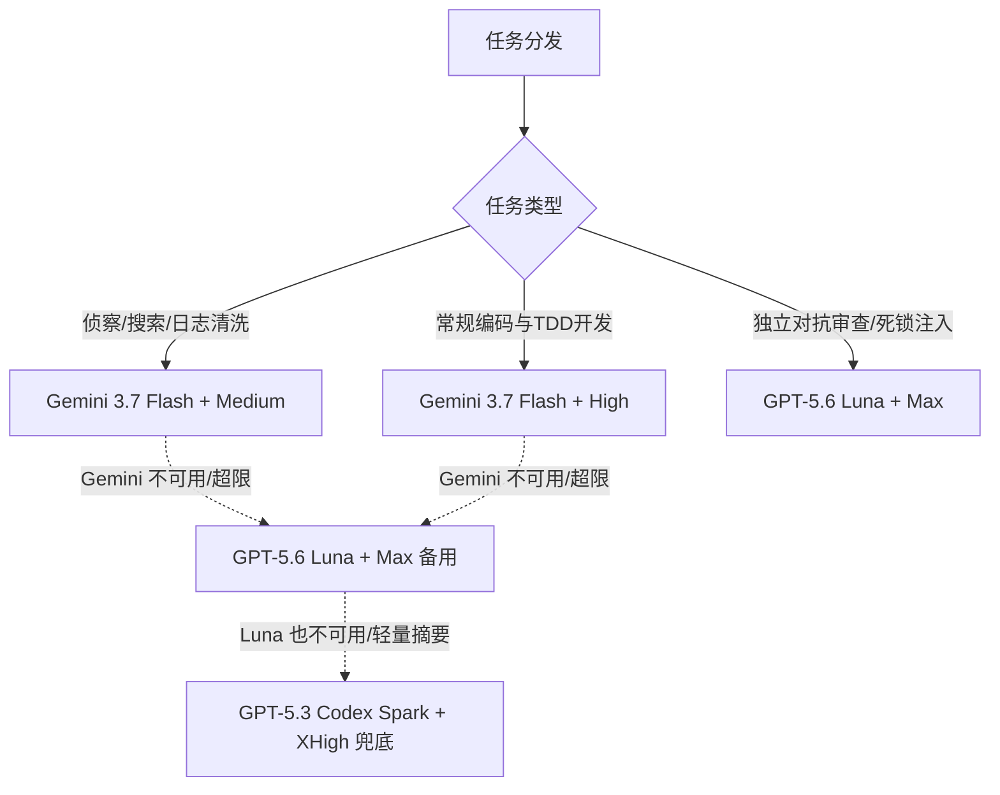

# 多模型动态路由与分配指南 (Model Routing & Allocation Guide)

在 Antigravity 2.0 与现代 Agentic AI 协作体系中，合理为不同子任务匹配模型和思考强度（Thinking Level），是兼顾**执行质量、响应延迟与 Token 成本**的核心。

---

## 1. 严格模型分工阶梯 (Gemini 优先 ➔ Luna 备用 ➔ Spark 兜底)

### 详细参数矩阵

| 梯队 / 角色 | 推荐模型代码 | 思考级别 (Thinking Level) | 适用场景与工作负载 | 关键规则与约束 |
| :--- | :--- | :--- | :--- | :--- |
| **侦察层 (Scout)** | `gemini-3.7-flash-tiered` | `medium` | 代码定义查找、跨模块依赖分析、长日志/文档扫描与压缩 | 头尾窗口截断（>150行截取并提炼3行摘要） |
| **执行层 (Builder)** | `gemini-3.7-flash-tiered` | `high` | 增量编写高密度业务代码、后端事务、TDD 单元测试断言 | 限定写入范围，由主线程 Sol 复核 Diff 与测试证据 |
| **独立审查层 (Adversary)** | `gpt-5.6-luna` | `max` | 独立红队对抗审查、并发死锁与竞态注入、盲盒 Diff 审计 | **Gemini 严禁自审**，必须由 Luna 提供无偏见独立审查 |
| **核心备用梯队 (Fallback 1)**| `gpt-5.6-luna` | `max` | Gemini 遇到额度受阻、网络不可用或隔离小修复时的主力替代 | 全能主力备用，严禁随意降级 |
| **轻量兜底梯队 (Fallback 2)**| `gpt-5.3-codex-spark`| `xhigh` | 仅在 Luna 也不可用时承接超轻量搜索、提取与摘要 | 严禁静默替换模型 |

---

## 2. 调度策略三大铁律

1. **主线程轻量化 (Lightweight Coordinator)**：主线程作为总指挥，不直接倾倒上百行源码或日志，优先将大块探索与编写下放给子 Agent。
2. **侦察先行，按需深思 (Tiered Reasoning)**：先用 `medium` 思考的 Scout 定位精准行号与依赖，再启动 `high` 思考的 Builder 定点改动，避免全局深思浪费算力。
3. **隔离审查无偏见 (Bias-Free Red-Team)**：编写代码的 Agent 与审查 Diff 的 Agent 必须相互独立，审查 Agent 不预设“代码肯定正确”的前提。
