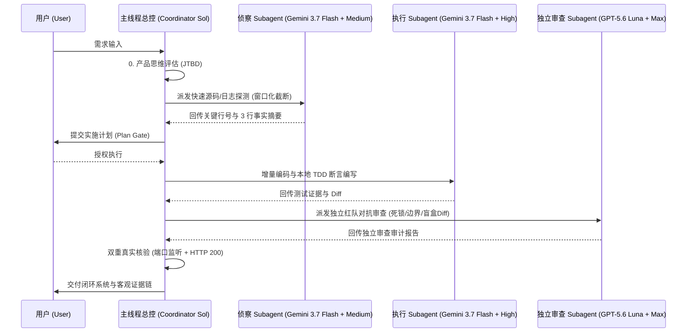

# 子 Agent 双轨协同与对抗审查工作流 (Subagent Workflow)

本指南阐述主线程总控（Sol）与执行轨（Executive Track）、独立审查轨（Audit Track）之间的标准化协作协议。

---

## 1. 双轨协同架构

---

## 2. 红队对抗审查三要素 (Red-Team Audit)

1. **并发与时序注入**：检查高并发请求下的竞态条件、死锁与连接池泄露。
2. **业务边界挑刺**：检查未处理的异常输入、权限越权（IDOR/BOLA）与边界溢出。
3. **盲盒 Diff 独立核验**：脱离编写者的先验偏见，仅针对 Git Diff 进行静态推演与压力注入。
